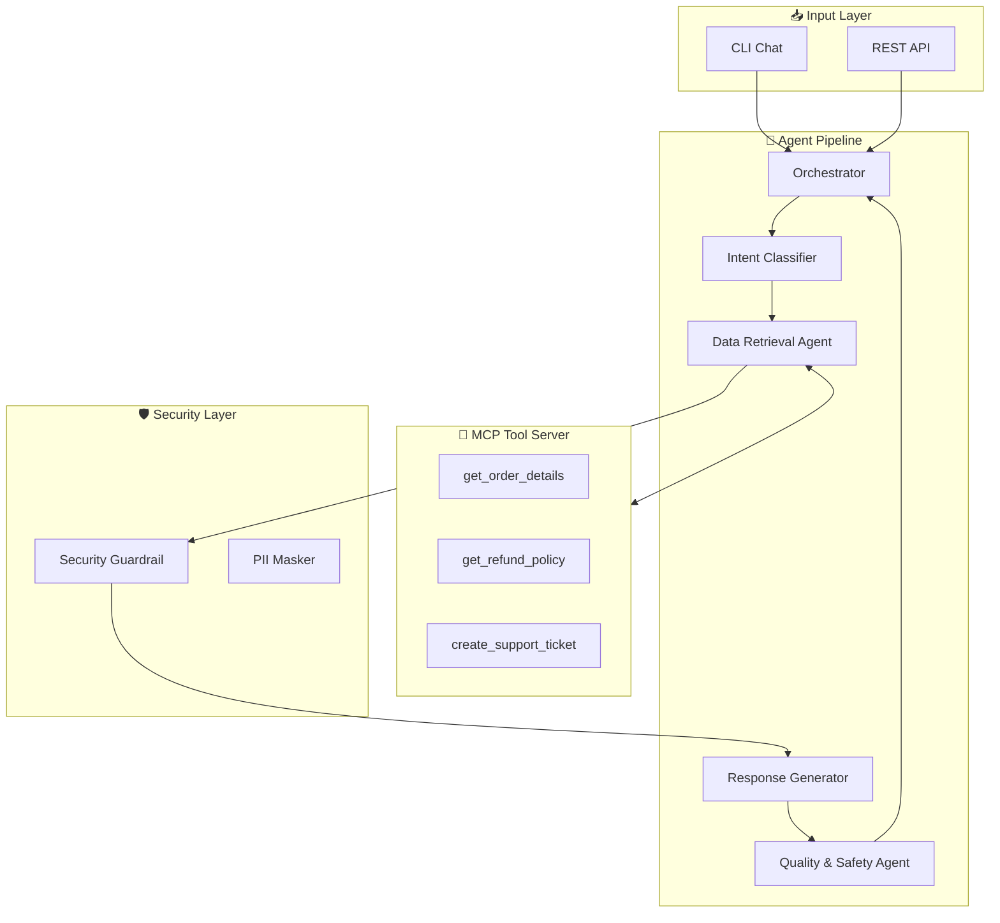

<div align="center">

# 🤖 Multi-Agent Customer Support Assistant for SMBs

[](https://www.python.org/downloads/)
[](tests/)
[](LICENSE)
[](https://www.kaggle.com/)

**A production-ready multi-agent AI system for automating customer support**

*Built for the Kaggle "5-Day Gen AI Intensive" Capstone Competition*

[View Demo](#-demo-video) • [Quick Start](#-quick-start) • [Documentation](#-documentation) • [Architecture](#-architecture)

---

### 🏆 Track: Agents for Business

</div>

## 📺 Demo Video

<div align="center">

https://github.com/user-attachments/assets/demo-video-placeholder

*Click to watch the full demo video showing the multi-agent system in action*

</div>

> **Note:** The demo video (`docs/multi_agent_support_demo.mp4`) showcases:
> - Real-time intent classification
> - Session memory with context resolution
> - Security guardrails blocking unauthorized access
> - Automatic ticket creation for escalations

---

## 🎯 Problem & Solution

<table>
<tr>
<td width="50%">

### ❌ The Problem

- **80%** of support tickets are repetitive questions
- Average response time: **4-24 hours**
- Support staff costs: **$35-50K/year** per agent
- Customer expectations: **instant, 24/7** availability

</td>
<td width="50%">

### ✅ Our Solution

- **< 1 second** average response time
- **24/7** automated availability
- **Secure** PII protection built-in
- **Scalable** to 10x volume without additional staff

</td>
</tr>
</table>

---

## 🏗️ Architecture



### Component Overview

| Component | Purpose | Location |
|-----------|---------|----------|
| **Orchestrator** | Coordinates agent pipeline, manages sessions | `src/orchestrator/` |
| **Intent Classifier** | Classifies customer intent (7 types) | `src/agents/intent_classifier.py` |
| **Data Retrieval** | Fetches data via MCP tools | `src/agents/data_retrieval.py` |
| **Response Generator** | Creates customer-facing replies | `src/agents/response_generator.py` |
| **Quality Agent** | Validates safety, masks PII | `src/agents/quality_safety.py` |
| **MCP Server** | Exposes 6 business tools | `src/mcp_server/server.py` |
| **Session Store** | SQLite persistence for multi-turn | `src/memory/session_store.py` |

---

## 📚 Course Concepts Implemented

This project demonstrates all **7 core concepts** from the 5-Day AI Agents course:

| # | Concept | Implementation | Status |
|---|---------|----------------|--------|
| 1 | **Multi-Agent Architecture** | 4 specialized agents in sequence | ✅ |
| 2 | **MCP Tool Server** | 6 business tools (orders, refunds, tickets) | ✅ |
| 3 | **Agent Skills / CLI** | Interactive chat with `/email`, `/session` commands | ✅ |
| 4 | **Session & Memory** | SQLite-backed persistent sessions | ✅ |
| 5 | **Security Guardrails** | PII masking, access control, lockout | ✅ |
| 6 | **Evaluation Suite** | 66 automated tests | ✅ |
| 7 | **Deployment Ready** | FastAPI REST endpoint | ✅ |

---

## 🚀 Quick Start

### Prerequisites

- Python 3.10+
- Git

### Installation

```bash
# Clone the repository
git clone https://github.com/Trungnef/ai-agents-business-support.git
cd ai-agents-business-support

# Create virtual environment
python -m venv .venv
.venv\Scripts\activate  # Windows
# source .venv/bin/activate  # Linux/Mac

# Install dependencies
pip install -r requirements.txt
```

### Run Quick Validation

```bash
# Verify everything works
python -m src.cli test all
```

Expected output:
```
✓ Intent classification tests passed
✓ PII masking tests passed
✓ Order authorization tests passed
```

### Interactive Demo

```bash
# Start chat mode
python -m src.cli chat

# Then try these commands:
/email alice.johnson@email.com
Where is my order ORD-2024-002?
Can I refund it?
/session
/quit
```

### Run All Tests

```bash
# Full test suite (66 tests)
pytest tests/ -v

# With coverage
pytest --cov=src --cov-report=html
```

---

## 🔧 Supported Intents

| Intent | Description | Example Query |
|--------|-------------|---------------|
| `order_status` | Track orders | "Where is my package?" |
| `refund_request` | Request refunds | "I want my money back" |
| `billing_issue` | Payment problems | "I was charged twice" |
| `account_access` | Login issues | "I can't access my account" |
| `shipping_issue` | Delivery problems | "Package shows delivered but I didn't get it" |
| `human_escalation` | Human agent | "Let me speak to a manager" |
| `other` | Unclassified | General questions |

---

## 🛡️ Security Features

<table>
<tr>
<td width="50%">

### PII Masking
```
Credit Card: 4242424242424242
→ **** **** **** 4242

Email: alice@example.com
→ a****@example.com

Phone: +1-555-0101
→ ***-***-0101
```

</td>
<td width="50%">

### Access Control
- ✅ Orders only accessible by owner
- ✅ Session lockout after 3 failures
- ✅ Cross-customer access blocked
- ✅ Internal IDs redacted

</td>
</tr>
</table>

---

## 📁 Project Structure

```
ai-agents-business-support/
├── src/
│   ├── agents/           # 4 specialized agents
│   ├── mcp_server/       # MCP tool server (6 tools)
│   ├── memory/           # SQLite session store
│   ├── security/         # PII masking, guardrails
│   ├── orchestrator/     # Pipeline coordinator
│   ├── api/              # FastAPI REST endpoints
│   └── cli.py            # Interactive CLI
├── tests/                # 66 automated tests
├── data/                 # Sample datasets
└── docs/                 # Documentation & video
```

---

## 📖 Documentation

| Document | Description |
|----------|-------------|
| [Architecture](docs/ARCHITECTURE.md) | System design with Mermaid diagrams |
| [Kaggle Writeup](docs/KAGGLE_WRITEUP_DRAFT.md) | Competition submission (~2,100 words) |
| [Video Script](docs/VIDEO_SCRIPT.md) | Demo video narration |
| [Demo Commands](docs/DEMO_COMMANDS.md) | Quick command reference |
| [Evaluation](docs/EVALUATION.md) | Test results and metrics |

---

## 🧪 Sample Data

The `data/` folder includes realistic test data:

| File | Records | Purpose |
|------|---------|---------|
| `customers.csv` | 10 | Customer profiles |
| `orders.csv` | 15 | Order data (various statuses) |
| `refund_policies.json` | - | Refund eligibility rules |
| `support_tickets.csv` | 5 | Existing tickets |

**Test Customers:**
- `alice.johnson@email.com` - Orders: ORD-2024-001, ORD-2024-002
- `bob.smith@email.com` - Orders: ORD-2024-003
- `carol.white@email.com` - Orders: ORD-2024-005

---

## 🚀 API Endpoints

Start the server:
```bash
uvicorn src.api.app:app --reload --port 8000
```

| Endpoint | Method | Description |
|----------|--------|-------------|
| `/chat` | POST | Send message, get response |
| `/session/{id}` | GET | Retrieve session state |
| `/session/{id}` | DELETE | Clear session |
| `/tools` | GET | List MCP tools |
| `/health` | GET | Health check |

API Docs: http://localhost:8000/docs

---

## 🤝 Contributing

This is a Kaggle competition project. Feedback and suggestions are welcome!

1. Fork the repository
2. Create a feature branch
3. Make your changes
4. Submit a pull request

---

## 📄 License

MIT License - see [LICENSE](LICENSE) for details.

---

## 🙏 Acknowledgments

- **Google AI** - 5-Day Gen AI Intensive course
- **Kaggle** - Hosting the Capstone competition
- **MCP Community** - Protocol specifications

---

<div align="center">

**Built with ❤️ for the Kaggle AI Agents Capstone 2026**

[](https://github.com/Trungnef)

</div>


