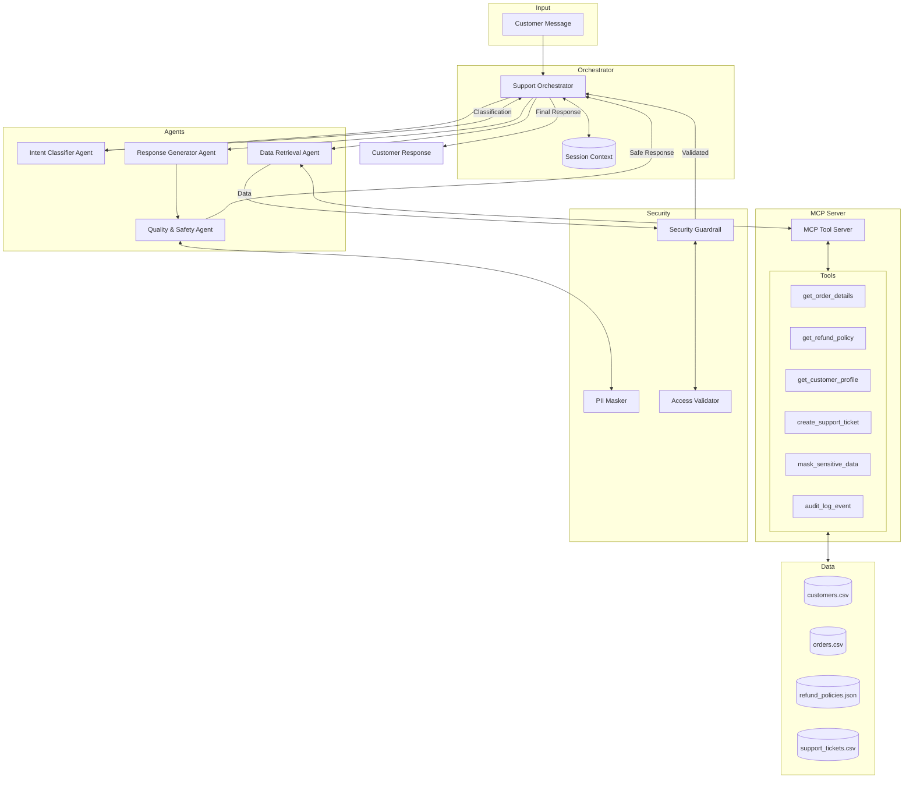

# Architecture Documentation

## Multi-Agent Customer Support Assistant for SMBs

### Overview

This system implements a multi-agent architecture for automated customer support, designed to handle common business inquiries while maintaining security and compliance standards.

### System Architecture



### Component Details

#### 1. Orchestrator (`src/orchestrator/`)

The central coordinator that manages the agent pipeline:

- Receives customer messages
- Maintains session context (conversation history, verified identities)
- Routes requests through the appropriate agent sequence
- Handles error recovery and fallbacks
- Returns final responses

**Key Responsibilities:**
- Session management
- Agent coordination
- Error handling
- Response assembly

#### 2. Agents (`src/agents/`)

##### Intent Classifier Agent
- **Input:** Raw customer message
- **Output:** `ClassificationResult` with intent, priority, and extracted entities
- **Model:** Uses LLM (Gemini) with structured output
- **Intents Supported:**
  - `refund_request` - Customer wants a refund
  - `order_status` - Checking order status/tracking
  - `billing_issue` - Payment or invoice problems
  - `account_access` - Login or account issues
  - `shipping_issue` - Delivery problems
  - `human_escalation` - Explicit request for human agent
  - `other` - Unclassified requests

##### Data Retrieval Agent
- **Input:** Classification result with entities
- **Output:** Relevant business data
- **Tools Used:** MCP tools for data access
- **Security:** Validates customer identity before data access

##### Response Generator Agent
- **Input:** Intent, retrieved data, context
- **Output:** Draft customer response
- **Style:** Friendly, professional, helpful
- **Constraints:** Never includes sensitive information

##### Quality & Safety Agent
- **Input:** Draft response
- **Output:** Validated final response
- **Checks:**
  - PII masking verification
  - Tone appropriateness
  - Factual accuracy
  - Policy compliance

#### 3. MCP Server (`src/mcp_server/`)

Exposes business tools via Model Context Protocol:

```python
# Tool Definitions
tools = [
    {
        "name": "get_order_details",
        "description": "Retrieve order information by order ID and customer email",
        "parameters": {
            "order_id": "string",
            "email": "string"
        }
    },
    {
        "name": "get_refund_policy",
        "description": "Get refund eligibility for an order",
        "parameters": {
            "order_id": "string"
        }
    },
    {
        "name": "get_customer_profile",
        "description": "Retrieve customer profile by email",
        "parameters": {
            "email": "string"
        }
    },
    {
        "name": "create_support_ticket",
        "description": "Create a support ticket for tracking",
        "parameters": {
            "customer_email": "string",
            "intent": "string",
            "priority": "string",
            "summary": "string"
        }
    },
    {
        "name": "mask_sensitive_data",
        "description": "Mask PII in text",
        "parameters": {
            "text": "string"
        }
    },
    {
        "name": "audit_log_event",
        "description": "Log an audit event",
        "parameters": {
            "event_type": "string",
            "payload": "object"
        }
    }
]
```

#### 4. Security Layer (`src/security/`)

##### Security Guardrail
- Intercepts all data before it reaches response generation
- Validates access permissions
- Applies data minimization principles

##### PII Masker
- Masks credit card numbers: `**** **** **** 4242`
- Masks emails: `a****@email.com`
- Masks phone numbers: `***-***-0101`
- Masks internal IDs: `[INTERNAL]`

##### Access Validator
- Verifies order belongs to requesting customer
- Checks account status (not suspended)
- Enforces rate limits on failed verifications

### Data Flow

1. **Request Reception**
   ```
   Customer → Orchestrator → Session Context Created/Retrieved
   ```

2. **Intent Classification**
   ```
   Message → Intent Classifier → {intent, priority, entities}
   ```

3. **Data Retrieval (if needed)**
   ```
   Entities → Data Retrieval Agent → MCP Tools → Security Validation → Safe Data
   ```

4. **Response Generation**
   ```
   Intent + Data + Context → Response Generator → Draft Response
   ```

5. **Quality Assurance**
   ```
   Draft → Quality/Safety Agent → PII Check → Final Response
   ```

### Session State Management

```python
ConversationContext:
  - session_id: str
  - customer_email: Optional[str]  # Verified email
  - verified_order_ids: List[str]  # Orders confirmed for this customer
  - intent_history: List[str]      # Previous intents in session
  - messages: List[dict]           # Conversation history
  - tools_called: List[dict]       # Audit trail
  - failed_verification_attempts: int
  - is_locked: bool                # Security lockout
```

### Security Model

#### Threat Model
1. **Information Disclosure** - Prevent leaking customer data to wrong person
2. **Prompt Injection** - Sanitize inputs, validate outputs
3. **Unauthorized Access** - Verify identity before data access
4. **Data Exfiltration** - Mask all PII in responses

#### Mitigations
- Email verification required for sensitive operations
- Order ID must match customer email
- Session lockout after 3 failed verifications
- All responses pass through PII masker
- Audit logging for compliance

### Course Concept Mapping

| Concept | Implementation |
|---------|---------------|
| ADK Multi-Agent | 4 specialized agents with defined roles |
| MCP Server | Tool server exposing 6 business operations |
| Skills/CLI | CLI entrypoint with demo commands |
| Session/State | ConversationContext with persistence |
| Security | PII masking, access validation, guardrails |
| Evaluation | pytest suite with 10+ test scenarios |

### File Structure

```
src/
├── __init__.py
├── cli.py                    # CLI entrypoint
├── agents/
│   ├── __init__.py
│   ├── base.py               # BaseAgent abstract class
│   ├── intent_classifier.py  # Intent classification
│   ├── data_retrieval.py     # Data fetching via MCP
│   ├── response_generator.py # Response drafting
│   └── quality_safety.py     # Final validation
├── tools/
│   ├── __init__.py
│   ├── order_tools.py        # Order-related tools
│   ├── customer_tools.py     # Customer profile tools
│   ├── ticket_tools.py       # Support ticket tools
│   └── security_tools.py     # Masking & logging
├── mcp_server/
│   ├── __init__.py
│   └── server.py             # MCP tool server
├── orchestrator/
│   ├── __init__.py
│   └── orchestrator.py       # Main coordinator
├── security/
│   ├── __init__.py
│   ├── guardrails.py         # Security checks
│   ├── pii_masker.py         # PII detection/masking
│   └── validators.py         # Access validation
├── schemas/
│   ├── __init__.py
│   ├── intent.py
│   ├── customer.py
│   ├── order.py
│   ├── ticket.py
│   └── message.py
└── eval/
    ├── __init__.py
    ├── evaluator.py          # Evaluation framework
    └── test_cases.py         # Sample test cases
```

### API Examples

#### CLI Usage
```bash
# Interactive mode
python -m src.cli chat

# Single message
python -m src.cli ask "Where is my order ORD-2024-002?"

# With email verification
python -m src.cli ask "I want a refund" --email alice.johnson@email.com
```

#### Programmatic Usage
```python
from src.orchestrator import SupportOrchestrator
from src.schemas import CustomerMessage

orchestrator = SupportOrchestrator()

message = CustomerMessage(
    content="I'd like to check on my order ORD-2024-002",
    customer_email="alice.johnson@email.com"
)

response = await orchestrator.process(message)
print(response.message)
```

### Deployment Considerations

For production deployment (beyond this demo):

1. **LLM API** - Use Google AI Studio or Vertex AI
2. **Database** - Replace CSV with PostgreSQL
3. **Caching** - Add Redis for session state
4. **Monitoring** - Structured logging to Cloud Logging
5. **Authentication** - Add proper customer auth
6. **Rate Limiting** - Implement per-customer limits
