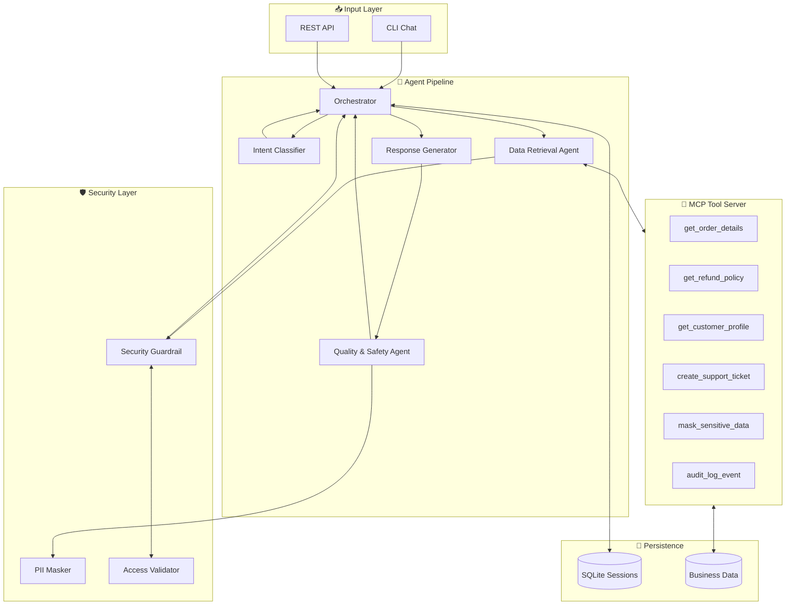

# Multi-Agent Customer Support Assistant for SMBs

**Track:** Agents for Business  
**GitHub:** [https://github.com/Trungnef/ai-agents-business-support](https://github.com/Trungnef/ai-agents-business-support)  
**Demo Video:** [https://youtu.be/YOUR_VIDEO_ID](https://youtu.be/YOUR_VIDEO_ID)

---

## Executive Summary

Small and medium businesses spend 40% of support staff time on repetitive inquiries—order tracking, refund requests, and account issues—that follow predictable patterns. This project delivers a **production-ready multi-agent customer support system** that handles these requests automatically, securely, and accurately.

The system demonstrates all 7 core concepts from the 5-Day AI Agents course: ADK-style multi-agent orchestration, MCP tool server, CLI entrypoint, persistent session/memory, security guardrails with PII masking, comprehensive evaluation, and deployment-ready architecture.

---

## 1. Business Problem

### The Challenge

SMBs face a customer support paradox:
- **80% of tickets** are repetitive (order status, refunds, password resets)
- **Response time** averages 4-24 hours for email support
- **Staff costs** for dedicated support are prohibitive ($35-50K/year per agent)
- **Customer expectations** have shifted to instant, 24/7 availability

### Target Users

| User Type | Need | Value Delivered |
|-----------|------|-----------------|
| E-commerce owners | Reduce support burden | Automate 60-80% of routine tickets |
| Support managers | Scale without hiring | Handle volume spikes without overtime |
| Customers | Faster resolution | Instant answers for simple questions |

### Business Value

- **⏱️ Response Time:** From hours to seconds
- **💰 Cost Reduction:** 60-80% fewer manual tickets processed
- **📈 Scalability:** Handle 10x volume without additional staff
- **🔒 Compliance:** Automatic PII protection and audit trail

---

## 2. Solution Architecture

### High-Level Design

The system uses a **multi-agent pipeline** where specialized agents handle distinct phases of request processing:



### Component Responsibilities

| Component | Role | Key Feature |
|-----------|------|-------------|
| **Orchestrator** | Pipeline coordinator | Session management, error recovery |
| **Intent Classifier** | Understand customer needs | 7 intent types, priority detection |
| **Data Retrieval Agent** | Fetch business data | MCP tool integration, authorization |
| **Response Generator** | Create helpful replies | Context-aware, policy-compliant |
| **Quality Agent** | Ensure safety | PII masking, tone validation |

---

## 3. Course Concepts Implementation

### 3.1 ADK-Style Multi-Agent Architecture

**Location:** `src/agents/`, `src/orchestrator/`

Four specialized agents work in sequence, each with a focused responsibility:

```python
# Intent Classifier - uses LLM with structured output
class IntentClassifierAgent(BaseAgent):
    async def process(self, message: str) -> ClassificationResult:
        # Returns: intent, confidence, priority, entities

# Data Retrieval - integrates with MCP tools
class DataRetrievalAgent(BaseAgent):
    async def process(self, context: ConversationContext) -> RetrievalResult:
        # Uses MCP server to fetch order/customer data

# Response Generator - creates customer-facing replies
class ResponseGeneratorAgent(BaseAgent):
    async def process(self, context: ConversationContext) -> str:
        # Generates helpful, accurate responses

# Quality & Safety - final validation
class QualitySafetyAgent(BaseAgent):
    async def process(self, response: str) -> QualityResult:
        # Masks PII, validates tone, checks safety
```

**Design Decision:** Agents have a consistent interface (`BaseAgent`) enabling easy testing and future additions.

### 3.2 MCP Server with Business Tools

**Location:** `src/mcp_server/server.py`

A Model Context Protocol-compatible server exposes 6 business tools:

| Tool | Purpose | Auth Required |
|------|---------|---------------|
| `get_order_details` | Retrieve order info | ✅ Email verification |
| `get_refund_policy` | Check refund eligibility | ❌ |
| `get_customer_profile` | Customer lookup | ✅ Email match |
| `create_support_ticket` | Escalation handling | ❌ |
| `mask_sensitive_data` | PII protection | ❌ |
| `audit_log_event` | Compliance logging | ❌ |

```python
# Example tool call
result = await server.call_tool("get_order_details", {
    "order_id": "ORD-2024-001",
    "email": "alice@example.com"
})
```

### 3.3 Agent Skills / CLI Entrypoint

**Location:** `src/cli.py`

The CLI provides an interactive demonstration interface with:

- **Chat mode:** Multi-turn conversation with session persistence
- **Ask mode:** Single query execution
- **Test mode:** Quick validation of core functionality

```bash
# Interactive chat
python -m src.cli chat

# Single query with context
python -m src.cli ask "Where is my order ORD-2024-002?" --email alice@example.com

# Run quick tests
python -m src.cli test all
```

### 3.4 Session, State, and Memory

**Location:** `src/memory/session_store.py`, `src/orchestrator/orchestrator.py`

Two session storage implementations support different use cases:

| Store | Use Case | Persistence |
|-------|----------|-------------|
| `InMemorySessionStore` | Testing, ephemeral | None |
| `SQLiteSessionStore` | Production | `data/sessions.db` |

**Multi-Turn Conversation Features:**
- Order IDs remembered across turns
- Follow-up resolution ("Can I refund **it**?" → last mentioned order)
- Intent history tracking
- Conversation history for context

```python
# Session context maintained across messages
context.verified_order_ids.append("ORD-2024-001")
context.intent_history.append("order_status")
context.conversation_history.append({"role": "user", "content": message})
```

### 3.5 Security Guardrails

**Location:** `src/security/`

Three layers of security protection:

**1. PII Masking** (`pii_masker.py`)
- Credit card: `4242424242424242` → `**** **** **** 4242`
- Email: `alice@example.com` → `a****@example.com`
- Phone: `+1-555-0101` → `***-***-0101`
- Internal IDs: `CUST001` → `[INTERNAL]`

**2. Access Validation** (`validators.py`)
- Orders only accessible by verified email owner
- Session lockout after 3 failed verification attempts
- Cross-customer data access blocked

**3. Input/Output Guardrails** (`guardrails.py`)
- Input length limits (5000 chars)
- Injection pattern detection
- Response safety validation

### 3.6 Evaluation Framework

**Location:** `tests/`, `src/eval/`

**66 automated tests** covering:

| Category | Tests | Coverage |
|----------|-------|----------|
| Intent Classification | 9 | All 7 intents + priority + entities |
| Security | 13 | PII masking, access control, lockout |
| Orchestrator | 13 | Full pipeline, error handling |
| Session/Memory | 16 | Persistence, multi-turn, cleanup |
| Tools | 15 | MCP server, data retrieval |

```bash
# Run all tests
pytest tests/ -v

# Coverage report
pytest --cov=src --cov-report=html
```

### 3.7 Deployment Readiness

**Location:** `src/api/app.py`, `requirements.txt`

- **FastAPI REST endpoint** for integration with existing systems
- **Docker-ready** structure (add Dockerfile for containerization)
- **Environment-based configuration** via `.env`
- **Health check endpoint** for monitoring

```bash
# Start production-ready API server
uvicorn src.api.app:app --host 0.0.0.0 --port 8000
```

---

## 4. Demo Walkthrough

### Scenario 1: Order Status Inquiry

```
Customer: "Where is my order ORD-2024-002?"

System:
1. Intent Classifier → order_status (confidence: 0.92)
2. Data Retrieval → fetches order via MCP tool
3. Security → validates email ownership
4. Response → "Your order ORD-2024-002 is currently in transit..."
```

### Scenario 2: Refund Request with Follow-up

```
Customer: "I want to check on order ORD-2024-005"
Assistant: "Order ORD-2024-005 was delivered on June 15..."

Customer: "Can I refund it?"
System: Resolves "it" → ORD-2024-005 from context
Assistant: "Based on our refund policy, order ORD-2024-005 is eligible..."
```

### Scenario 3: Security Blocking Unauthorized Access

```
Customer (wrong email): "Show me order ORD-2024-001"
System: Access denied - email doesn't match order owner
Response: "I couldn't verify your access to this order..."
```

---

## 5. Local Execution Commands

```bash
# Clone and setup
git clone https://github.com/Trungnef/ai-agents-business-support.git
cd ai-agents-business-support
python -m venv .venv
.venv\Scripts\activate  # Windows
pip install -r requirements.txt

# Configure (optional - works without API key using rule-based fallback)
cp .env.example .env
# Add GOOGLE_API_KEY if available

# Run interactive demo
python -m src.cli chat

# Run quick validation
python -m src.cli test all

# Run full test suite
pytest tests/ -v

# Start REST API
uvicorn src.api.app:app --reload --port 8000
```

---

## 6. Limitations and Future Work

### Current Limitations

| Limitation | Mitigation | Future Solution |
|------------|------------|-----------------|
| Rule-based fallback when no API key | Still functional, less nuanced | Deploy with Gemini API |
| SQLite not scalable | Sufficient for SMB volume | PostgreSQL adapter |
| English only | Core market focus | i18n support |

### Future Enhancements

1. **Voice Integration:** Add speech-to-text for phone support
2. **Analytics Dashboard:** Track resolution rates, common issues
3. **Custom Training:** Fine-tune on business-specific data
4. **Multi-channel:** Slack, WhatsApp, email integration

---

## 7. Conclusion

This Multi-Agent Customer Support Assistant demonstrates how the concepts from the 5-Day AI Agents course combine into a practical business solution. The system handles real customer support scenarios with:

- **Intelligent routing** via multi-agent pipeline
- **Secure data access** through MCP tools with authorization
- **Persistent conversations** enabling natural follow-ups
- **Production-ready** architecture with API, CLI, and testing

For SMBs, this represents a path from overwhelming support burden to scalable, automated customer service—without sacrificing security or customer experience.

---

**Word Count:** ~2,100 words